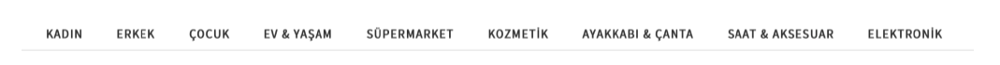

### Scenario:

You work as Software Development in Test role in our API team built recently. 
As a team, you’ll start to develop an API that does 4 operations (addition, subtraction, multiplication and, division) and calculates the sum of numbers from 1 to n.
The team will start to develop this task 2 weeks later, but you’re planning to develop test automation as of today. We expect you to create a test automation project for the following scenarios which you agreed with the team.

- API should only do GET and POST
- Must have a User Endpoint and use the received header after logging in 
- API header also must get a username, password. Otherwise it should return bad request
- The endpoint of API should be add, subtraction, multiplication, division. Query should take params as params list and perform the relevant operation. Response should also return the relevant result with result = . It should only be able to POST to these endpoints. It should be able to take up to 5 parameters as parameters.

***Example:***
~~~~
request : POST API_URL/add?params=1,2
response : result = 3, user=info
request : POST API_URL/multiplication?params=3,2,3
response : result = 18, user=info
request : API_URL/division?params=55,11
response :POST result = 5, user=info
~~~~

- Another endpoint of the API will be sum and the GET endpoint will return the sum of numbers from 1 to the entered value. This endpoint should only be able to take 1 parameter.

***Example:***
~~~~
request : Get API_URL/sum?params=5
response : result = 15, user=info
request : Get API_URL/sum?params=4
response : result = 10, user=info
~~~~

**PS:** You should remember that you do not have an API project that performs these operations. You can benefit from various practices. The best practice is to pay attention to assertions and status codes in API tests.

<h1 align="left"> UI Challenge </h1>

You work as Software Development in Test role at Trendyol Web UI team. 

### Scenario 1:

Your team refactored Log in and Sign up pages and you should create log in scenarios according to the new structure and develop automated tests. 

(PS: You can exclude the scenarios for Log in/Sign Up with Facebook and Google)

### Scenario 2:

As the team, you think you should develop the test scenario that performs the user scenarios given below. 

**2-1:**
- Log in to Trendyol with a user 
- “Oyuncu Bilgisayarı” is written to the search bar 
- Monster is chosen by using Brand at filter options 
- min 3000 max 10000 is chosen by using price filter 
- A desired product is added to the basket

**2-2:**
- Log in to Trendyol with a user
- “Gömlek” is written to the search bar
- A desired product is added to the Favorites 
- Go to Favorites
- The product added to Favorites is added to the basket. 

### Scenario 3:
The team started to receive feedback that the images of the first 4 products didn’t appear when you click on the first components by using the Tabs.
As a team, you decided to develop a scenario which controls this.

**3-1:**

- Tabs are clicked one by one 
- The first components are clicked
- It is logged the first 4 products and whether the images of these products are received
